<!-- profile-readme:v9 -->

  <h1>Xinchen Lee </h1>
  
<strong>AI, systems, and things I felt like building.</strong>

  

     small models
    &nbsp;·&nbsp;
     AI tooling
    &nbsp;·&nbsp;
     robotics & perception
    &nbsp;·&nbsp;
     scientific software
  

---

## ↗ Open source / live

<!-- profile-live:start -->

  

  
  

**Outside my repos**

- ✓ merged → [alibaba/open-code-review #1122](https://github.com/alibaba/open-code-review/pull/1122) · fix(rules): route JavaScript module files to JS rules
- ✓ merged → [farion1231/cc-switch #6851](https://github.com/farion1231/cc-switch/pull/6851) · fix(codex): mark glm-5.3 as text-only
- ✓ merged → [omdsh-dev/DSH-better-sidebar #301](https://github.com/omdsh-dev/DSH-better-sidebar/pull/301) · hide spawned git windows on Windows

↻ refreshed 5 Sep 2026 · 07:48 SGT
<!-- profile-live:end -->

---

<table>
<tr>
<td width="42%" valign="top">
<h3>✦ Selected work</h3>
🔬 <a href="https://github.com/teddyli18000/AiForMillikan"><strong>Millikan AI</strong></a> — oil-drop desktop tool. 
🖥️ <a href="https://github.com/teddyli18000/screen-clone-manager"><strong>Screen Clone Manager</strong></a> — Windows display cloning. 
☁️ <a href="https://github.com/teddyli18000/baidu-drive-mover"><strong>Baidu Drive Mover</strong></a> — resumable cloud transfers. 
🛠️ <a href="https://github.com/teddyli18000/XCAD"><strong>XCAD</strong></a> — C/C++ course final project.
</td>
<td width="27%" valign="top">
<h3>🧭 Current</h3>
🧠 <strong>Small models</strong> 
🧩 <strong>AI tooling</strong> 
🤖 <strong>Robotics &amp; perception</strong>
</td>
<td width="31%" valign="top">
<h3>🛸 Side quests</h3>
📬 <a href="https://github.com/teddyli18000/outlook-mail-helper"><strong>Outlook Mail Helper</strong></a> — inbox utility. 
🩻 <a href="https://github.com/teddyli18000/medical-img-preparer"><strong>Medical image preparer</strong></a> — preprocessing checks. 
🧪 <a href="https://github.com/teddyli18000/millikan-drop-processor"><strong>Millikan drop processor</strong></a> — oil-drop processing.
</td>
</tr>
</table>

---

## 🛠 Tech stack

  
  
  
  
  
  
  
  
  
  

---

## 🐍 Contribution trail

<picture>
  <source media="(prefers-color-scheme: dark)" srcset="https://raw.githubusercontent.com/teddyli18000/teddyli18000/output/github-snake-dark.svg">
  <source media="(prefers-color-scheme: light)" srcset="https://raw.githubusercontent.com/teddyli18000/teddyli18000/output/github-snake.svg">
  
</picture>

<!-- profile-footer:start -->
<em>“The purpose of computing is insight, not numbers.”</em> — Richard W. Hamming
<!-- profile-footer:end -->

