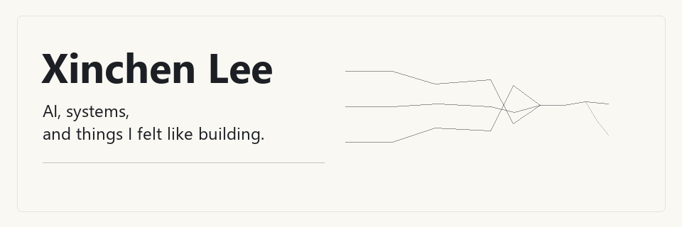
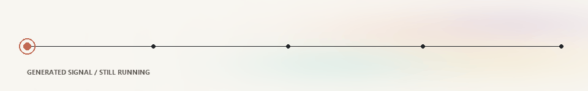
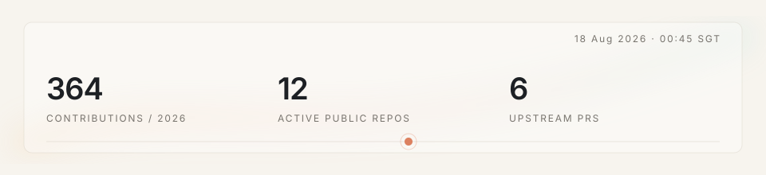

<!-- profile-readme:v1 -->
<picture>
  <source media="(prefers-reduced-motion: reduce) and (prefers-color-scheme: dark)" srcset="./assets/hero-dark.png">
  <source media="(prefers-reduced-motion: reduce)" srcset="./assets/hero-light.png">
  <source media="(prefers-color-scheme: dark)" srcset="./assets/hero-dark.gif">
  
</picture>

## Selected work

### [Millikan AI](https://github.com/teddyli18000/AiForMillikan)

Human-in-the-loop software for turning the Millikan oil-drop experiment into an inspectable measurement workflow.

01 / computer vision · scientific tooling · desktop

---

### [Screen Clone Manager](https://github.com/teddyli18000/screen-clone-manager)

Windows couldn't clone the display the way I wanted, so I built around it.

02 / Windows · OBS · systems

### [Baidu Drive Mover](https://github.com/teddyli18000/baidu-drive-mover)

Moving files between two clouds that were never particularly interested in cooperating.

03 / Go · resumability · reliability

### Current lines of work

**Building small language models** — from the tokenizer upward. 
tokenizer · pretraining · post-training · inference

**AI developer infrastructure** — routing models, coordinating agents, and connecting systems. 
routing · agents · connectors · tooling

**Robotics & perception** — exploring perception and coordination across robotic systems. 
vision · perception · coordination · embodied systems

## Open source / live

<picture>
  <source media="(prefers-reduced-motion: reduce) and (prefers-color-scheme: dark)" srcset="./assets/live-signal-dark.png">
  <source media="(prefers-reduced-motion: reduce)" srcset="./assets/live-signal-light.png">
  <source media="(prefers-color-scheme: dark)" srcset="./assets/live-signal-dark.gif">
  
</picture>

<!-- profile-live:start -->
<picture>
  <source media="(prefers-color-scheme: dark)" srcset="./assets/live-dark.svg">
  
</picture>

**Outside my repos**

- merged → [open-city-ai/haidian #61](https://github.com/open-city-ai/haidian/pull/61) · public AI infrastructure proposal
- open → [Waishnav/devspace #181](https://github.com/Waishnav/devspace/pull/181) · Git write operations through its Bash tool
- draft → [pandas-dev/pandas #66739](https://github.com/pandas-dev/pandas/pull/66739) · shared low-level Cython declarations

generated from public GitHub activity · updated 13 Aug · 00:50 SGT
<!-- profile-live:end -->

## Side quests

<picture>
  <source media="(prefers-reduced-motion: reduce) and (prefers-color-scheme: dark)" srcset="./assets/sidequest-dark.png">
  <source media="(prefers-reduced-motion: reduce)" srcset="./assets/sidequest-light.png">
  <source media="(prefers-color-scheme: dark)" srcset="./assets/sidequest-dark.gif">
  
</picture>

> not everything needed to exist.

Interfaces, automation, media systems, and strange little tools—usually built because leaving the annoyance alone felt worse.

<!-- profile-footer:start -->
some side quests became main quests.
<!-- profile-footer:end -->

 

Motion and system references

These are implementation references and a parts bin—not visual templates:

- Liquid glass: [liquid-glass-studio](https://github.com/iyinchao/liquid-glass-studio), [liquid-glass](https://github.com/archisvaze/liquid-glass), [liquidGL](https://github.com/naughtyduk/liquidGL), [shuding/liquid-glass](https://github.com/shuding/liquid-glass), [nikdelvin/liquid-glass](https://github.com/nikdelvin/liquid-glass)
- Motion fields: [paper-design/shaders](https://github.com/paper-design/shaders), [Cindori/FluidGradient](https://github.com/Cindori/FluidGradient), [liquid-shape-distortions](https://github.com/collidingScopes/liquid-shape-distortions)
- Living profiles: [recent-activity](https://github.com/Readme-Workflows/recent-activity), [metrics](https://github.com/lowlighter/metrics), [guilyx](https://github.com/guilyx/guilyx), [creative-profile-readme](https://github.com/coderjojo/creative-profile-readme)

