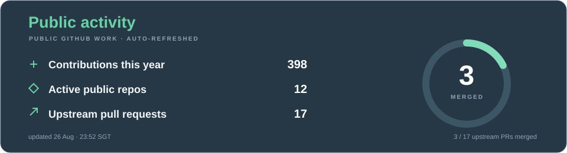

<!-- profile-readme:v7 -->

  <h1>Xinchen Lee </h1>
  
<strong>AI, systems, and things I felt like building.</strong>

  

     small models
    &nbsp;·&nbsp;
     AI tooling
    &nbsp;·&nbsp;
     robotics & perception
    &nbsp;·&nbsp;
     scientific software
  

  
mostly building · occasionally overengineering · sometimes both

---

## ↗ Open source / live

<!-- profile-live:start -->

  
  

**Outside my repos**

- ✓ merged → [omdsh-dev/DSH-better-sidebar #301](https://github.com/omdsh-dev/DSH-better-sidebar/pull/301) · hide spawned git windows on Windows
- ✓ merged → [pandas-dev/pandas #66739](https://github.com/pandas-dev/pandas/pull/66739) · shared low-level Cython declarations
- ✓ merged → [open-city-ai/haidian #61](https://github.com/open-city-ai/haidian/pull/61) · public AI infrastructure proposal
<!-- profile-live:end -->

---

## ✦ Selected work

-  **[Millikan AI](https://github.com/teddyli18000/AiForMillikan)** — AI-assisted Millikan oil-drop desktop tool.
-  **[Screen Clone Manager](https://github.com/teddyli18000/screen-clone-manager)** — OBS-based Windows display-cloning workaround.
-  **[Baidu Drive Mover](https://github.com/teddyli18000/baidu-drive-mover)** — resumable Baidu Netdisk → Google Drive transfers.
-  **[XCAD](https://github.com/teddyli18000/XCAD)** — C/C++ programming course final project.

### 🧭 Current lines

🧠 **Small models** · 🧩 **AI tooling** · 🤖 **Robotics & perception**

---

## 🛠 Tech stack

  
  
  
  
  
  
  
  
  
  

---

## 🛸 Side quests

- 📬 **[Outlook Mail Helper](https://github.com/teddyli18000/outlook-mail-helper)** — inbox checks + verification codes.
- 🩻 **[Medical image preparer](https://github.com/teddyli18000/medical-img-preparer)** — NIfTI/MSD preprocessing checks.
- 🧪 **[Millikan drop processor](https://github.com/teddyli18000/millikan-drop-processor)** — online/offline oil-drop processing.

---

## 🐍 Contribution trail

<picture>
  <source media="(prefers-color-scheme: dark)" srcset="https://raw.githubusercontent.com/teddyli18000/teddyli18000/output/github-snake-dark.svg">
  <source media="(prefers-color-scheme: light)" srcset="https://raw.githubusercontent.com/teddyli18000/teddyli18000/output/github-snake.svg">
  
</picture>

<!-- profile-footer:start -->
⌁ it worked on my machine. ⌁
<!-- profile-footer:end -->

